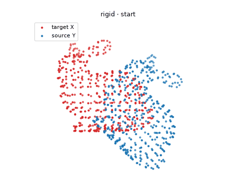
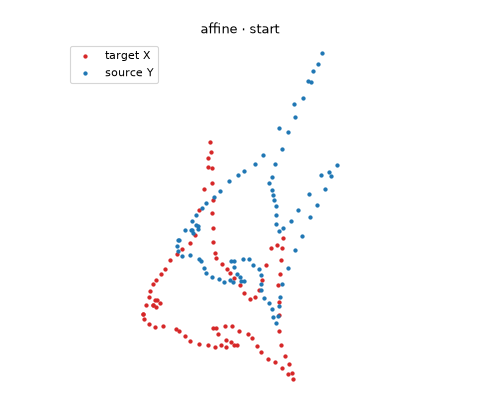
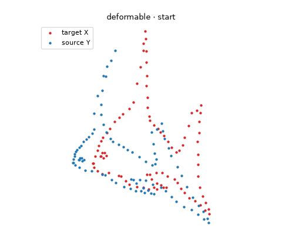
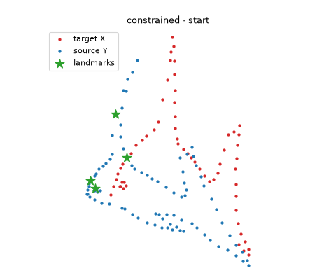

<h1 align="center">CPD-PyTorch</h1>

<h3 align="center">Coherent Point Drift point set registration in PyTorch</h3>

<p align="center">
  Rigid · Affine · Deformable · Landmark-guided — on CPU, CUDA or Apple GPUs, in float32 or float64
</p>

<p align="center">
  <a href="https://yuliangxiao.com"><b>Yuliang (Chris) Xiao</b></a> · University of Toronto
</p>

<p align="center">
  <a href="https://cpd-pytorch.readthedocs.io/"></a>
  <a href="https://pypi.org/project/cpd-pytorch/"></a>
  <a href="https://pypi.org/project/cpd-pytorch/"></a>
  <a href="https://github.com/YuliangXiaoYLX/CPD-Pytorch/actions/workflows/ci.yml"></a>
  <a href="https://colab.research.google.com/github/YuliangXiaoYLX/CPD-Pytorch/blob/main/examples/quickstart.ipynb"></a>
  <a href="LICENSE"></a>
</p>

<p align="center">
  <a href="#news"><b>News</b></a> ·
  <a href="#installation"><b>Installation</b></a> ·
  <a href="#quick-start"><b>Quick Start</b></a> ·
  <a href="#methods"><b>Methods</b></a> ·
  <a href="#performance"><b>Performance</b></a> ·
  <a href="#examples"><b>Examples</b></a> ·
  <a href="https://cpd-pytorch.readthedocs.io/"><b>Documentation</b></a> ·
  <a href="#citation"><b>Citation</b></a>
</p>

<table align="center">
  <tr>
    <td align="center" width="50%">
      <br>
      <b>Rigid</b><br>
      <sub>The bunny, rotated by 45° and shifted: CPD recovers the rotation, translation and scale.</sub>
    </td>
    <td align="center" width="50%">
      <br>
      <b>Affine</b><br>
      <sub>A fish outline, rotated, sheared and shifted: CPD recovers the full linear map.</sub>
    </td>
  </tr>
  <tr>
    <td align="center" width="50%">
      <br>
      <b>Deformable</b><br>
      <sub>Two different fish: a smooth displacement field bends one onto the other.</sub>
    </td>
    <td align="center" width="50%">
      <br>
      <b>Deformable with landmarks</b><br>
      <sub>A third of the target is missing; four known point pairs (stars) guide the fit.</sub>
    </td>
  </tr>
</table>

**CPD-PyTorch** aligns a moving point set `Y` to a fixed point set `X` without known
correspondences, using Coherent Point Drift ([Myronenko & Song, 2010](https://doi.org/10.1109/TPAMI.2010.46)):
the points of `Y` are the centers of a Gaussian mixture, fitted to `X` by
expectation-maximization while the centers move coherently. It keeps the interface of
[pycpd](https://github.com/siavashk/pycpd) and adds GPUs, batches and memory-bounded
computation for point sets of 100,000 points.

## News

- **2026-09 — CPD-PyTorch 1.0.** A rewrite, published on PyPI as `cpd-pytorch`
  ([#3](https://github.com/YuliangXiaoYLX/CPD-Pytorch/issues/3)): CUDA and Apple GPUs with a `dtype` argument for float32 or float64
  ([#4](https://github.com/YuliangXiaoYLX/CPD-Pytorch/issues/4), building on [#2](https://github.com/YuliangXiaoYLX/CPD-Pytorch/pull/2)), batched registration, a block-wise
  E-step that fits 100,000-point sets in under 1 GB, a faster low-rank solver,
  normalization, correspondences, results verified against pycpd, and documentation on
  Read the Docs. See the [changelog](CHANGELOG.md) and the
  [migration guide](https://cpd-pytorch.readthedocs.io/en/stable/migration/).
- **2024-03 — torchcpd 0.0.1.** The first installable release: a PyTorch port of pycpd
  (started in February 2023) with rigid, affine, deformable (including low-rank) and
  constrained deformable registration on the GPU.

## Highlights

- **Four methods**: rigid (with optional scaling), affine, deformable (with a low-rank option
  for large point sets) and deformable with known correspondences.
- **Any device and precision**: CPU, CUDA and Apple Silicon (MPS), in float32 or float64.
- **NumPy or PyTorch**: NumPy arrays in, NumPy arrays out; or tensors that stay on the GPU.
- **Batches**: register many point-set pairs in one call.
- **Large point sets**: memory grows linearly with the number of points, not quadratically.
- **Correspondences**: the most probable source point for every target point.
- **Verified**: matches pycpd to 1e-8 in float64; tested on Python 3.8-3.14 with PyTorch
  1.10-2.14 on Linux, macOS and Windows, and on CUDA and Apple GPUs.

## Installation

```bash
pip install cpd-pytorch
```

For GPU support, install the PyTorch build for your platform first
([instructions](https://pytorch.org/get-started/locally/)). Add matplotlib for the example
scripts with `pip install "cpd-pytorch[examples]"`.

## Quick Start

```python
from cpd_pytorch import RigidRegistration, datasets

X, Y = datasets.load_bunny()  # target and source, NumPy arrays (N, 3)
reg = RigidRegistration(X, Y)
TY, (s, R, t) = reg.register()  # TY = s * Y @ R + t, aligned with X
print(reg.iteration, s, t)
```

`register()` returns the transformed source points and the transform, as NumPy arrays
because the inputs were NumPy arrays. To use a GPU, pass `device`, or tensors that are
already on the GPU:

```python
import torch

reg = RigidRegistration(X, Y, device="cuda", dtype=torch.float32)  # NumPy in, NumPy out

X_gpu = torch.as_tensor(X, device="cuda", dtype=torch.float32)
Y_gpu = torch.as_tensor(Y, device="cuda", dtype=torch.float32)
TY, (s, R, t) = RigidRegistration(X_gpu, Y_gpu).register()  # tensors on the GPU
```

On Apple Silicon, use `device="mps"` with `dtype=torch.float32` (MPS has no float64).

Batches, large point sets and correspondences use the same classes:

```python
import numpy as np
from cpd_pytorch import DeformableRegistration

# 32 pairs at once: (B, N, D) and (B, M, D). An unbatched X is shared by every pair.
rng = np.random.default_rng(0)
Ys = np.stack([Y + rng.normal(0, 0.05, 3) for _ in range(32)])  # (32, 453, 3)
TY, (s, R, t) = RigidRegistration(X, Ys).register()
print(TY.shape, R.shape)  # (32, 453, 3) (32, 3, 3)

# Low-rank kernel and block-wise E-step for large point sets (add device="cuda" for a GPU),
# then the most probable source point for every target point.
reg = DeformableRegistration(X, Y, low_rank=True, normalize=True)
TY, _ = reg.register()
index = reg.correspondences()  # X[n] matches Y[index[n]]
```

## Methods

| Class                               | Transform       | Use it for                              | Parameters |
| ----------------------------------- | --------------- | --------------------------------------- | ---------- |
| `RigidRegistration`                 | `s * Y @ R + t` | Same shape, different pose (and size)   | `s, R, t`  |
| `AffineRegistration`                | `Y @ B + t`     | Shear or anisotropic scaling            | `B, t`     |
| `DeformableRegistration`            | `Y + G @ W`     | Shapes that bend or deform smoothly     | `G, W`     |
| `ConstrainedDeformableRegistration` | `Y + G @ W`     | Deformation with some known point pairs | `G, W`     |

The options you are most likely to need:

| Option                        | Default         | Meaning                                                                                                                             |
| ----------------------------- | --------------- | ----------------------------------------------------------------------------------------------------------------------------------- |
| `w`                           | `0`             | Weight of the outlier distribution; use 0.1-0.3 for noise, outliers or partial overlap.                                             |
| `normalize`                   | `False`         | Register in normalized coordinates, so the parameters below do not depend on your units. Recommended for deformable registration.   |
| `alpha`, `beta`               | `2`, `2`        | Deformable only: stiffness of the deformation and width of the Gaussian kernel (in data units, or RMS radii with `normalize=True`). |
| `low_rank`, `num_eig`         | `False`, `100`  | Deformable only: approximate the kernel, for large source point sets.                                                               |
| `max_iterations`, `tolerance` | `100`, `1e-3`   | Stopping criteria.                                                                                                                  |
| `device`, `dtype`             | from the inputs | Where and in which precision to compute.                                                                                            |
| `chunk_size`                  | automatic       | Target points per E-step block; lower it if you run out of GPU memory.                                                              |

## Performance

Time per EM iteration for random 3D point sets of `N = M` points, after a warm-up and
including the setup of each registration; memory in parentheses. The
[benchmarks page](https://cpd-pytorch.readthedocs.io/en/stable/benchmarks/) has all results, including float64 on
the GPU, the CPU up to 100,000 points and Apple GPUs.

NVIDIA RTX 3090, float32 (peak GPU memory):

| Method               |  Points | CPD-PyTorch 1.0 |   torchcpd 0.0.1 |
| -------------------- | ------: | --------------: | ---------------: |
| Rigid                |  20,000 |  49 ms (0.8 GB) |  95 ms (10.7 GB) |
| Rigid                | 100,000 |  1.2 s (0.8 GB) |    out of memory |
| Deformable           |  20,000 | 0.42 s (4.6 GB) | 1.37 s (12.2 GB) |
| Deformable, low rank |  20,000 |  59 ms (0.8 GB) |  1.1 s (12.2 GB) |
| Deformable, low rank | 100,000 |  1.4 s (0.8 GB) |    out of memory |

Apple M4 Pro CPU, float64 (peak process memory):

| Method               | Points | CPD-PyTorch 1.0 |  torchcpd 0.0.1 |             pycpd |
| -------------------- | -----: | --------------: | --------------: | ----------------: |
| Rigid                |  8,000 |  69 ms (0.7 GB) | 158 ms (5.4 GB) |   826 ms (5.4 GB) |
| Deformable, low rank |  5,000 |  46 ms (0.5 GB) | 734 ms (2.7 GB) | 1,042 ms (2.6 GB) |

## Examples

New to CPD? The [quick-start notebook](https://colab.research.google.com/github/YuliangXiaoYLX/CPD-Pytorch/blob/main/examples/quickstart.ipynb) runs in the browser on Google Colab, with
no installation.

The [`examples/`](examples/) folder has one short script per method (rigid, affine,
deformable, low-rank and constrained, in 2D and 3D) plus `batch_registration.py` and
`large_point_clouds.py`. Each runs from any directory and accepts `--device`, `--dtype`,
`--save animation.gif` and `--no-show`:

```bash
python examples/fish_deformable_2D.py --device cpu
```

## Documentation

The [documentation](https://cpd-pytorch.readthedocs.io/) has a user guide (methods, parameters, devices, batching,
large point sets), the API reference and a [migration guide](https://cpd-pytorch.readthedocs.io/en/stable/migration/)
for users of pycpd and of `torchcpd` 0.0.x.

## Citation

If you use CPD-PyTorch in your research, please cite both the Coherent Point Drift paper
and this library:

```bibtex
@article{myronenko2010cpd,
  title   = {Point Set Registration: Coherent Point Drift},
  author  = {Myronenko, Andriy and Song, Xubo},
  journal = {IEEE Transactions on Pattern Analysis and Machine Intelligence},
  volume  = {32},
  number  = {12},
  pages   = {2262--2275},
  year    = {2010},
  doi     = {10.1109/TPAMI.2010.46}
}

@software{xiao2026cpdpytorch,
  author  = {Xiao, Yuliang},
  title   = {{CPD-PyTorch}: Coherent Point Drift Point Set Registration in {PyTorch}},
  year    = {2026},
  version = {1.0.0},
  url     = {https://github.com/YuliangXiaoYLX/CPD-Pytorch},
  license = {Apache-2.0}
}
```

The software entry is also in [`CITATION.cff`](CITATION.cff), which GitHub's "Cite this
repository" button reads.

## Acknowledgements

CPD-PyTorch started as a PyTorch port of [pycpd](https://github.com/siavashk/pycpd) by
Siavash Khallaghi (MIT License, see [`NOTICE`](NOTICE)). Registration with known
correspondences follows the Extended CPD of Golyanik et al. (2016).

## License

This project is licensed under the [`Apache 2.0 License`](LICENSE).

## Star History

<a href="https://www.star-history.com/?repos=YuliangXiaoYLX%2FCPD-Pytorch&type=date&legend=top-left">
 <picture>
   <source media="(prefers-color-scheme: dark)" srcset="https://api.star-history.com/chart?repos=YuliangXiaoYLX/CPD-Pytorch&type=date&theme=dark&legend=top-left&sealed_token=iu-vAQADK5X3QwiSqgi_7Uvxu55zUdoZFfoz4T5LEAVyNBL0TG7vj326ln8A58jwTs-3JuXe2RD_hPVkugQBO_4G4Tt_dh5bJU8UpA7xsLfzfZc2zRnJyz0FiSGuUWnJCG77SkcUOe9xeyLTzmTILGg-2lzAVQ8QKWDUlBYy4j9r0Cvu9SlX1abKzoZeFEG28ThDvMMbV9l4Nz39tkjp1fUTSRwcg8eYjfo1y4z5uOxke333i4iMAJpLxCd611B8EOrroeP7AYsjqe9jS0_mNOFiElj6mf3YO-Z1IZDBQg0rtOeDN4Pp_R4Jzs0ZWmlsB52aAwcMKXhjMwsZBit_Tch8AiPxml1JRdeyzFTDrHXEwBkTYz0QVt3BsgG-6ZemwJRiVRpdRb3qxM6BwFPHcgCKnC9KWpK-c81VsIYYu28kMFE5K5vfdEAASRXf4Pn3bd-9-LFb2oNZg3caCy3urmWhNyogwhSr0ui-Ev5ZZEWyZqkWf6njuSPbUV3U-VmbJ0qSmMppq0NAuhEMA7AzxX0HKLnDr7bdQ7tHnBntjMwXrYrj0nydI_l7q3MtFj8mvTxEFdRA_ILu0CbhaZCiN79KLwaO7YAjk4kLginAqRoIYFRKvDccFB2odNLmwYegCqrZcIgWdF_4PoT097tWdvGtqYtAlgP57tyW0AXTxwb4Wi60A5TiPgsAGqEJHepdyaR60qfoYdCxbuK4tJSmEqkrcj8MU5l2f-YB42Adi7NKJIhwS6nRj5yVoGYCIObf6SThvA2rM52URrLOTBo4VP_c47UYUTjjRh7rCxnPCnGvya1AwNsSq5ZHxZd69ZTVAKlvVpWrLhK_NA7IfmJ34mTpOQaLOKg7WcZN9R4pUofBg2l2grk88tWmbF4GFZURLgKO-_ZZ_y1YakAW5EF10Ug1SrOwg4C7hYk1WsWY_D-duCe7XIpEG4uSuU1TYI37kpG71lreopiv93ndk21U2hsAQIEBR6QKEPbjUTVoPp00fWPBtTXXNIojpviqGi5vebT67LI-x8Ntu5436_3O56NOWeJuYDM1KZ1IlVL-I2GdqRAGcNIADjYWlpt8REXBHvb8wIiz_F02lN6gjEN3L40c4OXyBSGKNZCg6kGVdKq8S9Zgos7-STWju61cYCIc9icwHe3oX9wKISYv62aDnMENex7bwViwVyku4qADonSKL6QSnMRjEMHxS8K68HRYKKMNnK9UIwT6HpntpGVt2BYFVdyissHgMcLj15owQU1p-abPuOKNXzBAa7QCpT_Uke4b95pn0zPKkQmNV9w2kyDjP-SDJugiISREjyvyznYWWS7ONP6QV__vytRXZp3NhL9lY00ZYk_4cJ8COq9NssRWlj1mGvC7pi0" />
   <source media="(prefers-color-scheme: light)" srcset="https://api.star-history.com/chart?repos=YuliangXiaoYLX/CPD-Pytorch&type=date&legend=top-left&sealed_token=iu-vAQADK5X3QwiSqgi_7Uvxu55zUdoZFfoz4T5LEAVyNBL0TG7vj326ln8A58jwTs-3JuXe2RD_hPVkugQBO_4G4Tt_dh5bJU8UpA7xsLfzfZc2zRnJyz0FiSGuUWnJCG77SkcUOe9xeyLTzmTILGg-2lzAVQ8QKWDUlBYy4j9r0Cvu9SlX1abKzoZeFEG28ThDvMMbV9l4Nz39tkjp1fUTSRwcg8eYjfo1y4z5uOxke333i4iMAJpLxCd611B8EOrroeP7AYsjqe9jS0_mNOFiElj6mf3YO-Z1IZDBQg0rtOeDN4Pp_R4Jzs0ZWmlsB52aAwcMKXhjMwsZBit_Tch8AiPxml1JRdeyzFTDrHXEwBkTYz0QVt3BsgG-6ZemwJRiVRpdRb3qxM6BwFPHcgCKnC9KWpK-c81VsIYYu28kMFE5K5vfdEAASRXf4Pn3bd-9-LFb2oNZg3caCy3urmWhNyogwhSr0ui-Ev5ZZEWyZqkWf6njuSPbUV3U-VmbJ0qSmMppq0NAuhEMA7AzxX0HKLnDr7bdQ7tHnBntjMwXrYrj0nydI_l7q3MtFj8mvTxEFdRA_ILu0CbhaZCiN79KLwaO7YAjk4kLginAqRoIYFRKvDccFB2odNLmwYegCqrZcIgWdF_4PoT097tWdvGtqYtAlgP57tyW0AXTxwb4Wi60A5TiPgsAGqEJHepdyaR60qfoYdCxbuK4tJSmEqkrcj8MU5l2f-YB42Adi7NKJIhwS6nRj5yVoGYCIObf6SThvA2rM52URrLOTBo4VP_c47UYUTjjRh7rCxnPCnGvya1AwNsSq5ZHxZd69ZTVAKlvVpWrLhK_NA7IfmJ34mTpOQaLOKg7WcZN9R4pUofBg2l2grk88tWmbF4GFZURLgKO-_ZZ_y1YakAW5EF10Ug1SrOwg4C7hYk1WsWY_D-duCe7XIpEG4uSuU1TYI37kpG71lreopiv93ndk21U2hsAQIEBR6QKEPbjUTVoPp00fWPBtTXXNIojpviqGi5vebT67LI-x8Ntu5436_3O56NOWeJuYDM1KZ1IlVL-I2GdqRAGcNIADjYWlpt8REXBHvb8wIiz_F02lN6gjEN3L40c4OXyBSGKNZCg6kGVdKq8S9Zgos7-STWju61cYCIc9icwHe3oX9wKISYv62aDnMENex7bwViwVyku4qADonSKL6QSnMRjEMHxS8K68HRYKKMNnK9UIwT6HpntpGVt2BYFVdyissHgMcLj15owQU1p-abPuOKNXzBAa7QCpT_Uke4b95pn0zPKkQmNV9w2kyDjP-SDJugiISREjyvyznYWWS7ONP6QV__vytRXZp3NhL9lY00ZYk_4cJ8COq9NssRWlj1mGvC7pi0" />
   
 </picture>
</a>

---

<p align="center">Developed by Chris Xiao | University of Toronto</p>
